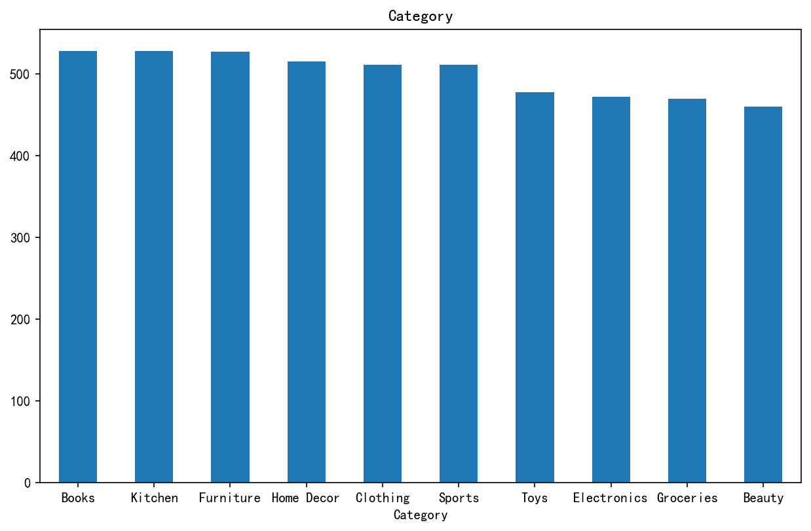
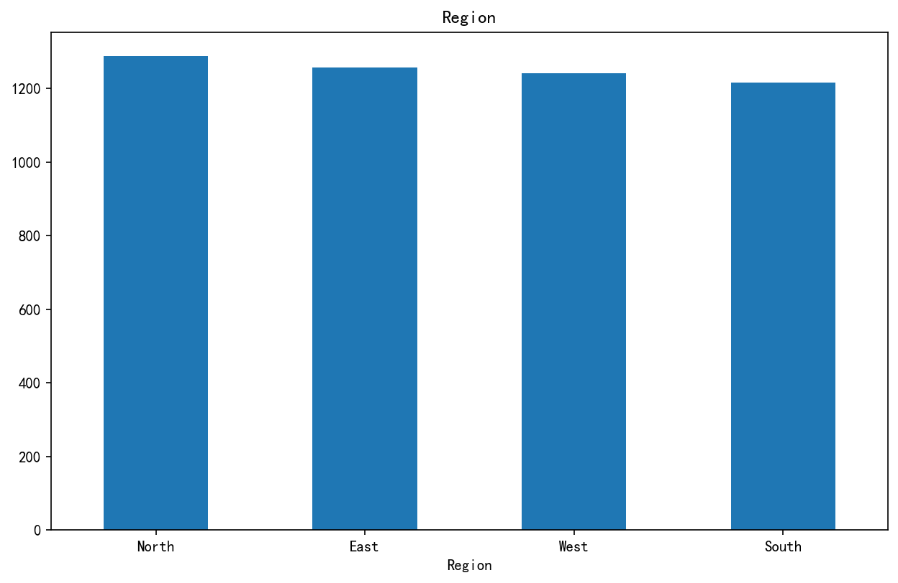
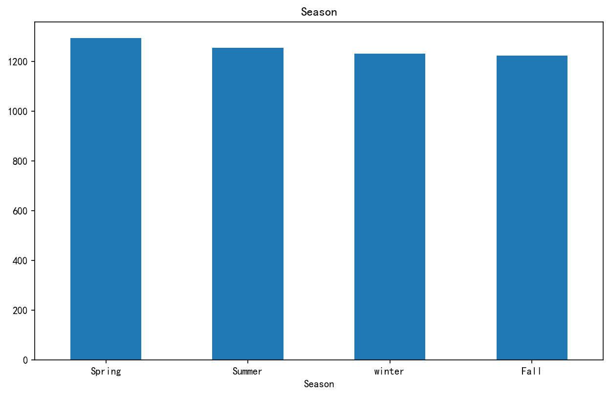
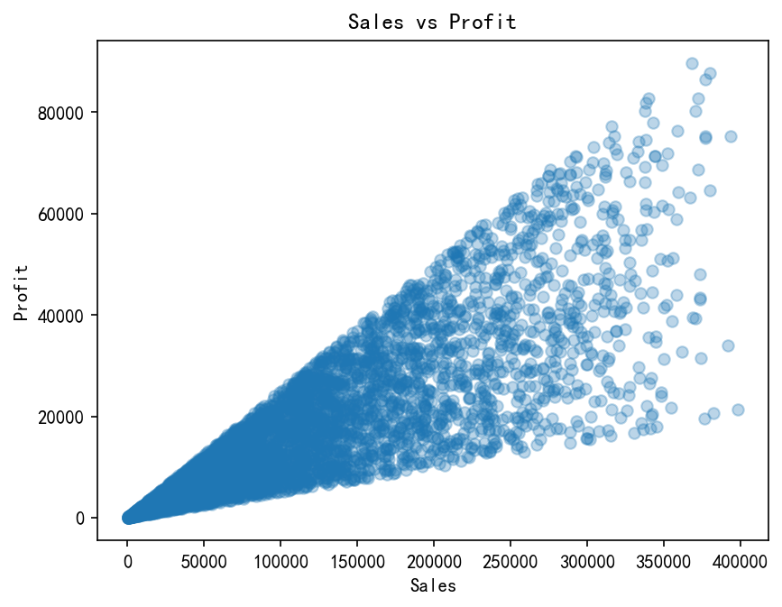

# 📊 电商全渠道销售数据挖掘与用户价值分层（沙盒推演项目）

> **项目状态**：数据探索、可视化分析、RFM用户分层模型  
> **技术栈**：Python (Pandas, NumPy, Matplotlib), Tableau  
> **数据来源**：Kaggle 公开模拟电商销售数据

---

## 1. 项目背景与数据说明

本项目使用的是一份来自 Kaggle 的 **开源模拟电商销售数据（Mock Data）**，数据时间跨度为 2023 年至 2025 年。

**⚠️ 数据质量声明**：
在项目启动初期的 EDA（探索性数据分析）阶段，我识别出该数据集存在明显的**人工合成痕迹**。例如，`Quantity`（购买数量）与 `Discount`（折扣率）字段呈现出高度均匀的离散分布，与真实商业场景中“极少数人买多件，绝大多数人买1件；极少数大促，绝大多数原价”的长尾分布截然不同。

因此，本项目的核心定位并非为某家真实企业提供精准的业绩预测，而是**旨在展示一套完整、严谨、可复用的商业数据分析框架与业务决策推导流程**。

---

## 2. 📊 交互式仪表盘 (Tableau)

为了更好地展示分析结果，我使用 Tableau 制作了交互式仪表盘，支持按地区、品类、时间自由筛选查看：

👉 **[点击此处查看 Tableau 公共仪表盘](https://public.tableau.com/views/ecommerce_sales_17809225161720/1?:language=zh-CN&publish=yes&:sid=&:redirect=auth&:display_count=n&:origin=viz_share_link)**

---

## 3. 核心分析与图表解读（Python 产出）

### 3.1 数值型字段总体分布
使用 Matplotlib 对 `Sales`、`Profit` 等字段绘制了直方图。


**图表解读**：`Sales`（销售额）和 `Profit`（利润）呈现非常典型的**右偏长尾分布**，说明极少数的**高客单价大额订单**贡献了平台绝大部分的销售总额和利润。

### 3.2 分类维度占比拆解
分别对 `Category`（品类）、`Region`（地区）、`Season`（季节）绘制了频次柱状图：





**图表解读**：品类占比极其均衡，10个大类的订单量几乎完全一致，说明这是一个**综合型抗风险平台**，没有明显的单一爆款依赖。

### 3.3 销售额与利润的相关性分析
绘制了 `Sales` 与 `Profit` 的散点图：



**图表解读**：图中存在大量“销售额极高，但利润接近0”的异常点。结合数据集中20%的高折扣频发，推测这部分“高销低利”的订单主要是**被过度的折扣让利侵蚀了利润**。

### 3.4 月度销售趋势（季节性分析）
按 `Order_Month` 汇总销售额，绘制折线图：


**图表解读**：**5月**出现销售额尖峰（推测与特定促销季或换季消费有关），**2月和9月**处于明显低谷（典型的销售淡季）。基于此，可提炼出 **“淡季清仓、旺季备货”** 的宏观运营策略。


### 3.5 RFM 用户价值分层模型
基于经典的 RFM 模型（最近一次消费、消费频率、消费金额），将客户划分为 **普通客户、高消费客户、忠诚客户、高价值客户** 四大类。


**核心业务洞察**：
- 高价值客户（98人）+ 忠诚客户（56人）合计仅 154 人。
- **高消费客户高达 2,287 人！** 这意味着有近 2300 名客户消费金额极高，但购买频率极低（买一次或两次就走）。

---

## 4. 结论与业务策略建议（商业落地）

基于以上分析，结合电商真实商业逻辑，推导出以下针对性策略：

1. **促销重点（警惕折扣陷阱）**：
   - 散点图显示“过度折扣”会严重侵蚀利润。**策略**：建立“折扣利润红线”预警机制，当大额订单的折扣率超过盈亏平衡点时，**自动拦截或提醒运营审批**，避免赔本赚吆喝。

2. **客户维护（死磕存量价值）**：
   - **核心痛点**：2,287 名高消费客户“买完就走”，高价值客户仅占 **~2%**。
   - **策略**：与其盲目烧钱拉新，不如**定向激活存量**。针对这 2300 名“高消费低频客户”，定向发放“阶梯复购满减券”或“会员专属返现”，用低成本把他们从“一次性买家”变成“忠诚客户”，这是提升平台 GMV 最具杠杆效应的策略。

3. **品类与时间优化**：
   - 利用 5 月旺季效应，运营部门应在 4 月下旬大规模备货并策划集中促销；在 2 月和 9 月淡季，集中进行尾货清仓和内部复盘。

---

## 5. 如何查看详细报告与运行代码

点击下方按钮下载完整项目压缩包（内含 PDF 报告、源码及所有图表）：

[📥 下载项目 ZIP](https://github.com/okya0505/ecommerce-analysis/archive/main.zip)

### 运行项目
```bash
# 克隆仓库
git clone https://github.com/okya0505/ecommerce-analysis.git

# 安装依赖（推荐使用虚拟环境）
pip install pandas numpy matplotlib seaborn

# 运行分析（确保本地已经安装了 Jupyter Notebook 或直接运行 python 脚本）
python analysis.py
