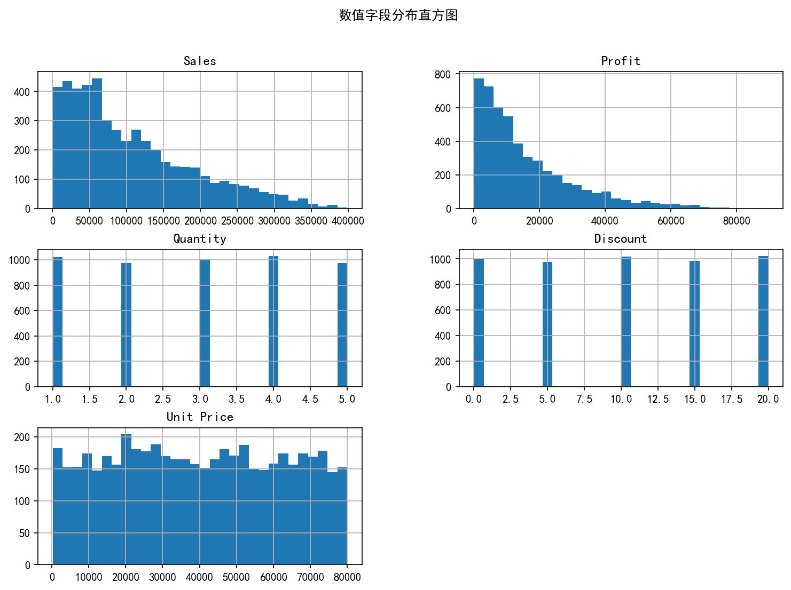
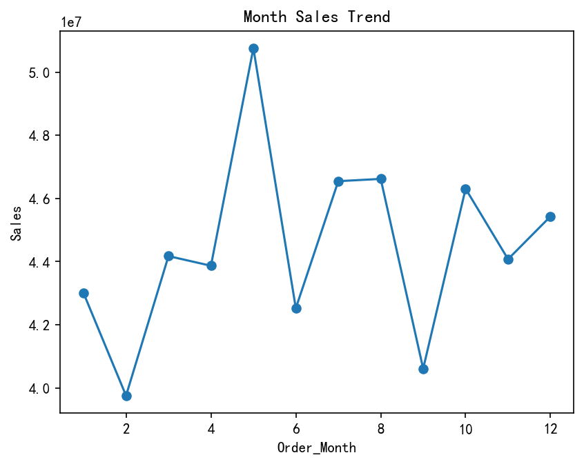
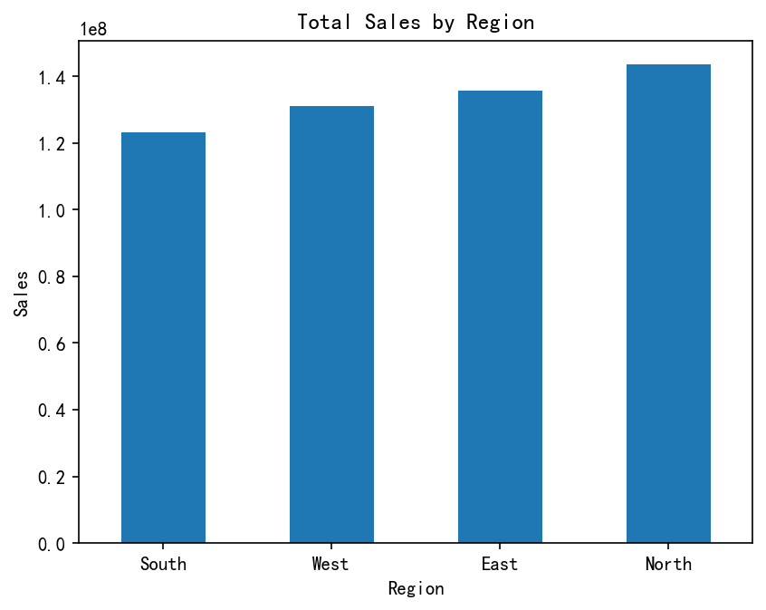
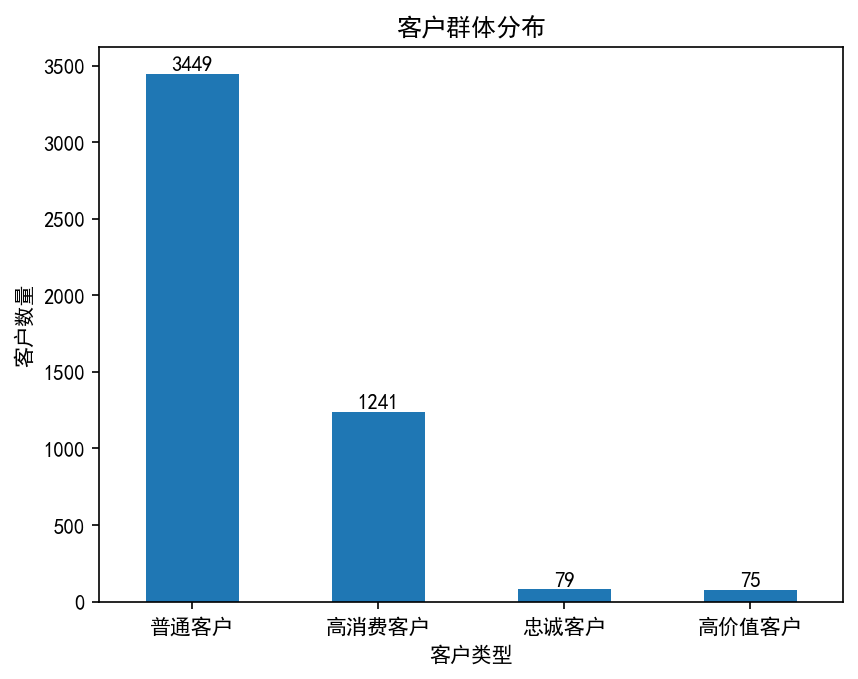

# 电商数据分析项目 (2024-2025)

## 项目背景
基于 Kaggle 公开数据集（E-Commerce Sales 2024-2025），使用 Python 进行数据清洗、探索性分析（EDA）、RFM 客户价值分层，并输出分析报告。

## 技术栈
- Python (pandas, numpy, matplotlib, seaborn)
- Jupyter Notebook / PyCharm
- Git & GitHub

## 项目文件说明
- `clean_data.py` – 数据清洗脚本
- `analysis.py` – 主分析脚本（EDA + RFM）
- `ecommerce_sales_clean.csv` – 清洗后的数据（示例）
- `rfm_result.csv` – RFM 打分及客户分层结果
- `电商数据分析报告.pdf` – 详细分析报告（含业务建议）
- 各类 `.png` 图表 – 可视化图片

## 核心分析内容
### 1. 数据清洗
- 处理缺失值、异常值
- 转换日期格式，提取季节、星期等特征
- 计算折扣率、利润率

### 2. 探索性分析（EDA）
- 销售额、利润、折扣等数值分布
- 不同地区、品类、支付方式的销售对比
- 月度销售趋势（11-12月为高峰）





### 3. RFM 客户分层
- 计算 Recency（最近购买天数）、Frequency（购买次数）、Monetary（总消费额）
- 针对 Frequency 大量重复（96% 客户仅购买一次）采用自定义评分规则
- 将客户分为：高价值、忠诚、高消费、普通四类



## 结论与业务建议
- **促销重点**：折扣对销售额有明显正向作用，可在淡季适当加大折扣力度。
- **客户维护**：高价值客户占比仅 ~8%，建议通过会员积分、定向优惠提升复购率。
- **品类优化**：电子产品销售额占比最高，可扩展相关配件品类。

## 如何查看详细报告
[点击下载 PDF 报告](https://github.com/okya0505/ecommerce-analysis/raw/main/%E7%94%B5%E5%95%86%E6%95%B0%E6%8D%AE%E5%88%86%E6%9E%90%E6%8A%A5%E5%91%8A.pdf)

## 运行项目
```bash
# 克隆仓库
git clone https://github.com/okya0505/ecommerce-analysis.git

# 安装依赖（推荐使用虚拟环境）
pip install pandas numpy matplotlib seaborn

# 运行分析
python analysis.py
